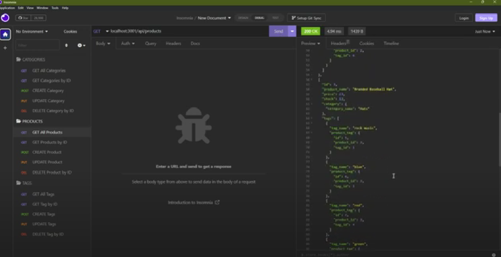

# Ecommerce back-end

[Ecommerce back-end video demonstration](https://drive.google.com/file/d/1-oPGDNFI5SXhxck3-j77Ifq4xl9zIWS7/view)

## Description
A backend database built with MySQL2, Sequelize, and Dotenv to store information for the products of an ecommerce store.

## Installation
Clone this repository, install npm init, mysql2, sequelize, and dotenv.
Once all dependencies are installed, start the project in your terminal with the command mysql -u root -p and input your information, then run 'source db/schema.sql', 'quit', 'npm run seed', 'npm start'.